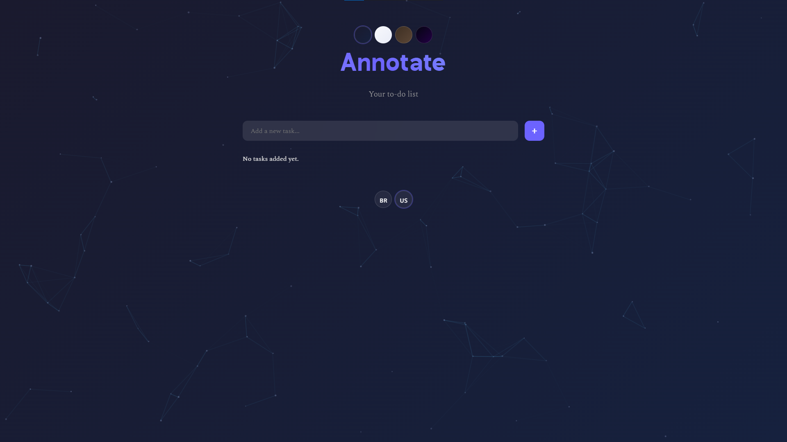
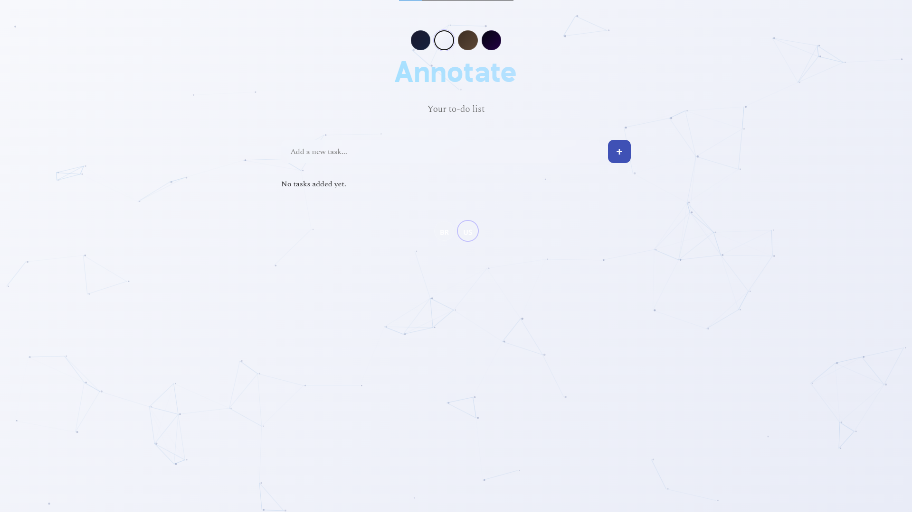
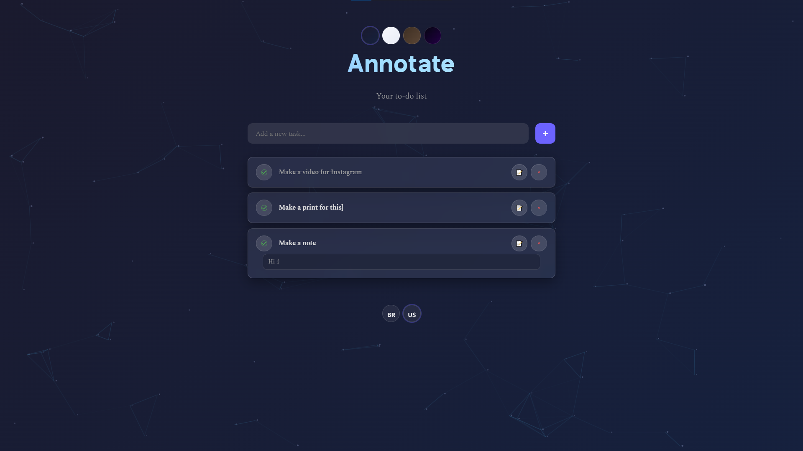

# Annotate — To‑Do List

    

Visit the live demo: https://kanb4.github.io/Annotate/

Annotate is a clean, responsive to‑do list web app. Add tasks, mark them as done, attach notes, switch themes, and toggle language (Portuguese/English). Everything is saved locally via `localStorage` — no backend required.

## Features

- **Multiple themes**: Dark, Light, Vintage, Neon using CSS variables (`data-theme`).
- **Multilingual (PT/EN)**: language toggle with persistence in `localStorage`.
- **Notes per task**: edit in a modal; saved notes are shown under each task.
- **Persistence**: tasks, theme and language are stored in the browser (`localStorage`).
- **Animated background**: connected particles with subtle parallax; respects `prefers-reduced-motion`.
- **Basic accessibility**: `aria` labels, button titles, and visible focus.
- **Responsive**: mobile-friendly layout.

## Screenshots

- **Home — Dark theme**

  

- **Home — Light theme**

  

- **Task with notes**

  

Add your images to the `screenshots/` folder or update the paths above.

## Usage

1. **Add task**: type in “Add a new task…” and press Enter or click “+”.
2. **Complete task**: click the round check button.
3. **Notes**: click “📝”, write notes in the modal, then click “Save”.
4. **Delete**: click “×” and confirm.
5. **Theme**: use the theme buttons at the top (Dark/Light/Vintage/Neon).
6. **Language**: use the footer buttons (🇧🇷/🇺🇸).
7. **Persistence**: data is saved automatically in your browser.

## Tech Stack

- HTML5, CSS3, vanilla JavaScript.
- `localStorage` for persistence.
- Canvas 2D for particle animation.

## Roadmap (Ideas)

- Filters (All / Active / Completed).
- Drag‑and‑drop reordering.
- Export/Import tasks (JSON).
- E2E tests and enhanced accessibility.

## License

MIT — feel free to use, modify, and distribute with attribution.
